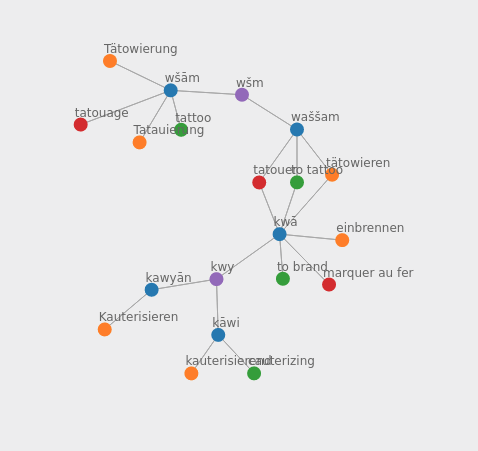
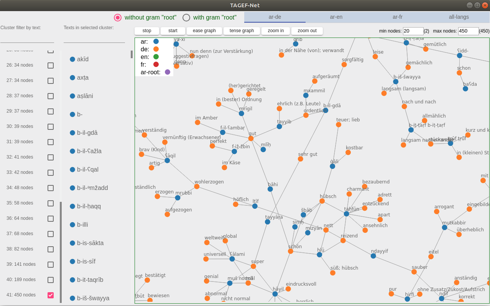

TAGEF-Net for ELEXIS-Hackathon
====================

Thomas Burch burch@uni-trier.de
Li Sheng sheng@uni-trier.de

## Short description:

In this repository we implemented a networks visualization application based on the given TUNICO dictionary to show the relationships between Tunis Arabic words and its translations in German, English and French. We call our application **TAGEF-Net** (Tunis Arabic German English French Network). 

First of all, we did some statistcal analysis about the given dictionary data using scripts and XPath. The results can be found in file [analysis/results.md](analysis/results.md).

Then according to the analysis and the amount of time we have, we decided to do a networks visualization about the Arabic words and their translations. You can find a detailed introduction of it in the section [Presentation](#Presentation). We tried to visualize the connections between Arabic words and other languages with and without the Arabic "root" information (which encoded in tag `gram` with type `root`). Here is a simple example with Arabic "root":



We can see that the Arabic roots “kwy” and “wšm” are indirectly connected with each other in one network because they have the similar meaning about “tattoo”, “brand” and “cauterizing”.

> Due to lack of time and straightforward functionalities there is no specific unit-test code or CI tool like `travis` integrated in the implementation. Bug reports or feature requests are always welcome. 

Here is a preview of the **TAGEF-Net** application



## Presentation:

Please see the presentation file [presentation/TAGEF-Net.odp](presentation/TAGEF-Net.odp).

## How to run it:

### dependencies:

* nodejs >= v10.0.0
* python >= v3.6

For how to install nodejs and python please see [nodejs](https://nodejs.org/en/) and [python](https://www.python.org/)


### repocessing data:

In this repository there are prepared JSON data based on the given TUNICO dictionary. If you would like to reproduce the data from changed dictionary, you can put this dictionary XML-data in `data/` and run this command:

```
  python src/translationCluster.py data/name-of-dict-file.xml
```

The produced JSON data will be also in `data/` directory.

Note:

> If you use new XML-data, the data must have the same stucture like the given TUNICO dictionary.

### starting TAGEF-Net visualization:

The TAGEF-Net application for visualization of the networks in the given dictionary is in directory `frontend/`. You can start it from this directory by using following commands:

```
  # go to the application directory
  cd frontend

  # install module dependencies
  npm install

  # if you run it the first time
  npm run first-start

  # for start it again
  npm run start
```

## For development:

### for further developing the data proceccing scripts:

The data processing scripts are in directory `src/`. The file `TunisArabicClusterBuilder.py` holds the methods to generate the JSON data which are loaded in the application for visualizing the networks in the dictionary. The file `translationCluster.py` is an example how to use this data builder script.

### for further developing the visualization application:

You can just run the following command in directory `frontend/` and open the application in browser with `http://localhost:4001`. Every time the source code will be changed, then the application will be automatically reloaded.

```
  # go to the application directory
  cd frontend

  # install module dependencies
  npm install

  # start developing the TAGEF-Net application 
  npm run dev

```

## Some notes for data cleaning or data errors:

Here we list some errors or things we don't fully understand in the given TUNICO dictionary.

### 2 translations directly under entries:

    //tei:div[@type="entries"]/tei:entry[count(./tei:cit) > 0]

### typo error: 

    "mutliWordUnit"

### possible data errors:

* 1 translation is splitted in 2 translations 

```
<cit xml:id="claa_qadd_ma_rayyadhtu_wa_laa_habb_yifhim_001" type="example">
  <quote xml:lang="ar-aeb-x-tunis-vicav">ʕlā qadd-ma ṛayyaḏ̣tu wa-lā ḥabb yifhim</quote>
  <bibl>Singer 1984, p. 683</bibl>
  <!-- should the following two be one translations??? -->
  <cit type="translation" xml:lang="de">
    <quote>So sehr ich ihm auch gut zuredete</quote>
  </cit>
  <cit type="translation" xml:lang="de">
    <quote>er wollte nicht verstehen.</quote>
  </cit>
</cit>
```

```

<entry xml:id="mcayyin_002">
  <form type="lemma">
    <orth xml:lang="ar-aeb-x-tunis-vicav">mʕayyin</orth>
    <bibl>Singer 1984, p. 411</bibl>
  </form>
  <!-- ... -->
  <sense>
    <cit type="translation" xml:lang="en">
      <quote>certain</quote>
    </cit>
    <cit type="translation" xml:lang="en">
      <quote>particular</quote>
    </cit>
    <cit type="translation" xml:lang="en">
      <quote>specific</quote>
    </cit>
    <cit type="translation" xml:lang="de">
      <quote>bestimmt</quote>
    </cit>
    <!-- should the following two be one translations??? -->
    <cit type="translation" xml:lang="de">
      <quote>festgesetzt (Termin</quote>
    </cit>
    <cit type="translation" xml:lang="de">
      <quote>Datum)</quote>
    </cit>
  <!-- ... -->
</entry>
```

* dummy translations such as empty string or '-' are not considered. 

* entry (or entries), which has repeated translations 

```
<entry xml:id="sallah_001">
  <form type="lemma">
    <orth xml:lang="ar-aeb-x-tunis-vicav">ṣaḷḷaḥ</orth>
    <bibl>Singer 1984, p. 373</bibl>
  </form>
  <!-- ... -->
  <sense>
    <cit type="translation" xml:lang="en">
      <quote/>
    </cit>
    <cit type="translation" xml:lang="de">
      <quote>wieder gut</quote>
    </cit>
    <cit type="translation" xml:lang="de">
      <quote>tauglich machen</quote>
    </cit>
    <cit type="translation" xml:lang="de">
      <quote>in guten Zustand bringen</quote>
    </cit>
    <cit type="translation" xml:lang="fr">
      <quote/>
    </cit>
  </sense>
  <sense>
    <cit type="translation" xml:lang="en">
      <quote/>
    </cit>
    <cit type="translation" xml:lang="de">
      <quote>wieder gut/tauglich machen</quote>
    </cit>
    <cit type="translation" xml:lang="de">
      <quote>in guten Zustand bringen</quote>
    </cit>
    <cit type="translation" xml:lang="fr">
      <quote/>
    </cit>
  </sense>
</entry>
```

* entry (or entries), which has the same gramGrp more than 1 time

```
<entry xml:id="shal_001">
  <form type="lemma">
    <orth xml:lang="ar-aeb-x-tunis-vicav">shal</orth>
    <bibl>Ritt-Benmimoun 2014</bibl>
    <bibl>Singer 1984, p. 111, p. 131, p. 136, p. 335</bibl>
    <form type="variant">
      <orth xml:lang="ar-aeb-x-tunis-vicav">sʔal</orth>
    </form>
  </form>
  <gramGrp>
    <gram type="pos">verb</gram>
    <gram type="subc">I</gram>
    <gram type="root" xml:lang="ar-aeb-x-tunis-vicav">sʔl</gram>
  </gramGrp>
  <form type="inflected" ana="#v_pres_sg_p3">
    <orth xml:lang="ar-aeb-x-tunis-vicav">yishal</orth>
  </form>
  <form type="inflected" ana="#v_pres_sg_p3">
    <orth xml:lang="ar-aeb-x-tunis-vicav">yisʔal</orth>
  </form>
  <form type="inflected" ana="#v_pres_sg_p3">
    <orth xml:lang="ar-aeb-x-tunis-vicav">yasʔal</orth>
  </form>
  <gramGrp>
    <gram type="pos">verb</gram>
    <gram type="subc">I</gram>
    <gram type="root" xml:lang="ar-aeb-x-tunis-vicav">sʔl</gram>
  </gramGrp>
  <!-- ... -->
</entry>
```

* over 2000 entries, which have more than 1 en-, de- and fr-translations in one "sense"

```
//tei:div[@type="entries"]/tei:entry[count(./tei:sense[count(./tei:cit[@type="translation" and @xml:lang="de"]) > 1 and count(./tei:cit[@type="translation" and @xml:lang="en"]) > 1  and count(./tei:cit[@type="translation" and @xml:lang="en"]) > 1]) > 0]
```

example:
```
<entry xmlns="http://www.tei-c.org/ns/1.0" xml:id="ibliis_001">
  <form type="lemma">
    <orth xml:lang="ar-aeb-x-tunis-vicav">iblīs</orth>
  </form>
  <gramGrp>
    <gram type="pos">properNoun</gram>
    <gram type="root" xml:lang="ar-aeb-x-tunis-vicav">ʔbls</gram>
  </gramGrp>
  <sense>
    <cit type="translation" xml:lang="en">
        <quote>the devil</quote>
    </cit>
    <cit type="translation" xml:lang="en">
        <quote>Satan</quote>
    </cit>
    <cit type="literalTranslation" xml:lang="en">
        <quote>Iblis</quote>
    </cit>
    <cit type="translation" xml:lang="de">
        <quote>der Teufel</quote>
    </cit>
    <cit type="translation" xml:lang="de">
        <quote>Satan</quote>
    </cit>
    <cit type="literalTranslation" xml:lang="de">
        <quote>Iblis</quote>
    </cit>
    <cit type="translation" xml:lang="fr">
        <quote>le diable</quote>
    </cit>
    <cit type="translation" xml:lang="fr">
        <quote>Satan</quote>
    </cit>
    <cit type="literalTranslation" xml:lang="fr">
        <quote>Iblis</quote>
    </cit>
  </sense>
  <!-- ... -->
</entry>
```